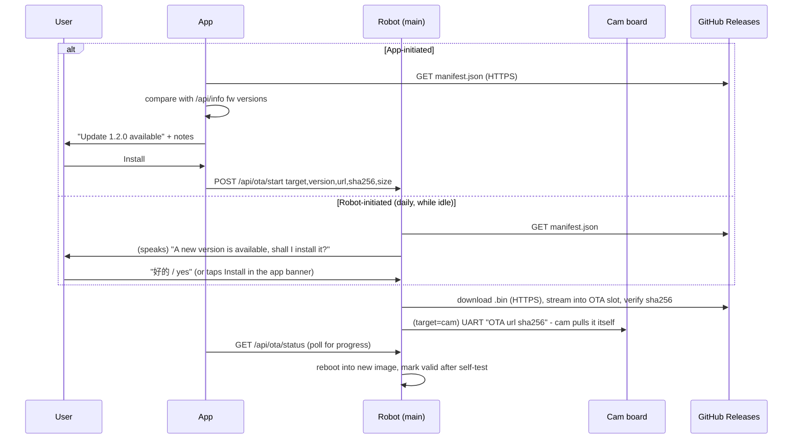

# Firmware updates (no backend)

There is no server of our own in v1, so **GitHub Releases is the update
server**. Each release publishes the binaries plus one `manifest.json`:

```
https://github.com/tacq/enco02/releases/latest/download/manifest.json
```

```json
{
  "schema": 1,
  "components": {
    "main": {
      "version": "1.2.0",
      "url": "https://github.com/tacq/enco02/releases/download/v1.2.0/enco02_main.bin",
      "sha256": "<64 hex>",
      "size": 2912256,
      "min_from": "1.0.0",
      "notes": { "en": "Smoother head motion", "zh": "头部动作更顺滑" }
    },
    "cam": { "...": "same shape" }
  }
}
```

> [!NOTE]
> The repo must be public for this URL to work without credentials. If it
> stays private, publish releases to a separate public repo and point
> `AppConfig.manifestUrl` / the firmware's manifest URL there.

## Two ways an update starts, one way it installs



**The robot is always the one that downloads and installs.** The app never
streams firmware to the robot. Reasons:
- The robot already has internet access (it talks to the AI cloud).
- An install doesn't break if the phone sleeps or walks out of range.
- Voice approval and app approval go through the same code path.

The app's job is to discover updates, show the release notes in the user's
language, ask for approval, and show progress.

## Firmware work this implies (not done yet)

- **Main board, flash layout.** The current table has a single 3.9 MB app slot,
  and the image is ~2.9 MB, so two A/B slots don't fit in 4 MB. Options:
  1. Move to an 8 MB / 16 MB WROOM module, then use the standard
     `ota_0`/`ota_1` with rollback. *Recommended for the product.*
  2. Stay on 4 MB: a small `factory` updater image (~1 MB, Wi-Fi + HTTPS +
     esp_ota only) plus one ~2.9 MB `ota_0`. The app reboots into the updater,
     which overwrites `ota_0`. It is not A/B, but it stays recoverable: if the
     download fails, the device remains in the updater and retries.
- **Memory.** OTA must only start in standby. Stop the camera view and the
  voice session first; HTTPS needs ~40 KB of contiguous heap for TLS.
- **Cam board.** It already has two 1.9 MB slots (`min_spiffs.csv`). Add an
  HTTPS pull (`esp_https_ota`) triggered by a UART command from the main
  board. The main board reports progress through `/api/ota/status`.
- **Integrity.** Check the sha256 from the manifest (fetched over HTTPS) before
  `esp_ota_set_boot_partition`.
  TODO(security): sign images (ESP32 Secure Boot v2 or an ed25519 signature
  over the manifest, with the public key baked into firmware). A sha256 from
  an HTTPS manifest only protects against corruption, not against a
  compromised release account.
- **Rollback.** `CONFIG_BOOTLOADER_APP_ROLLBACK_ENABLE`; call
  `esp_ota_mark_app_valid_cancel_rollback()` after Wi-Fi + display come up.
- **Voice prompt.** A new MCP tool `self.firmware.update(confirm)` lets the
  model ask for consent and then start the install.
